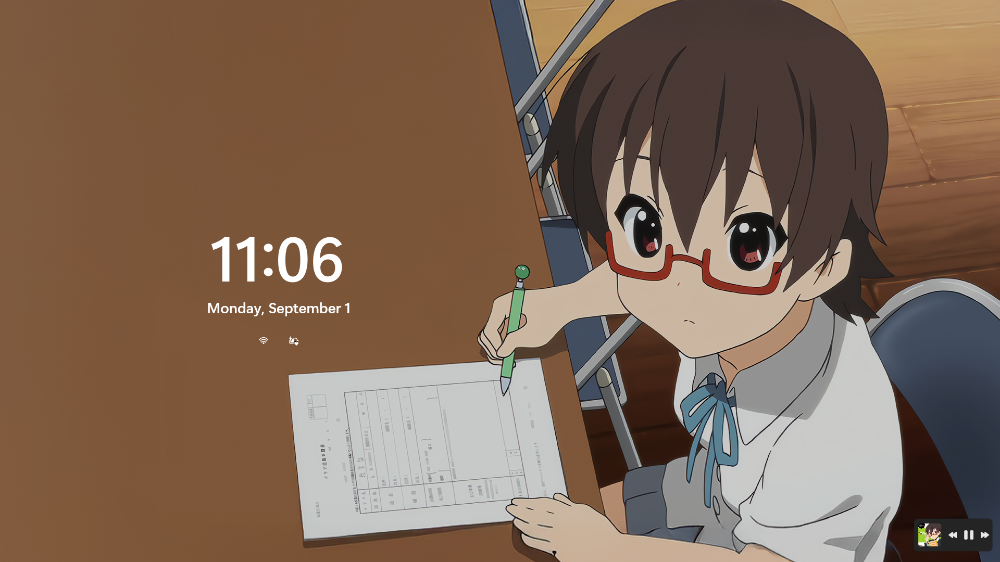
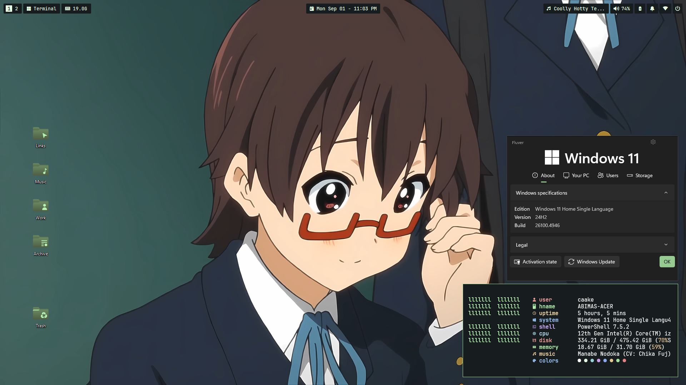
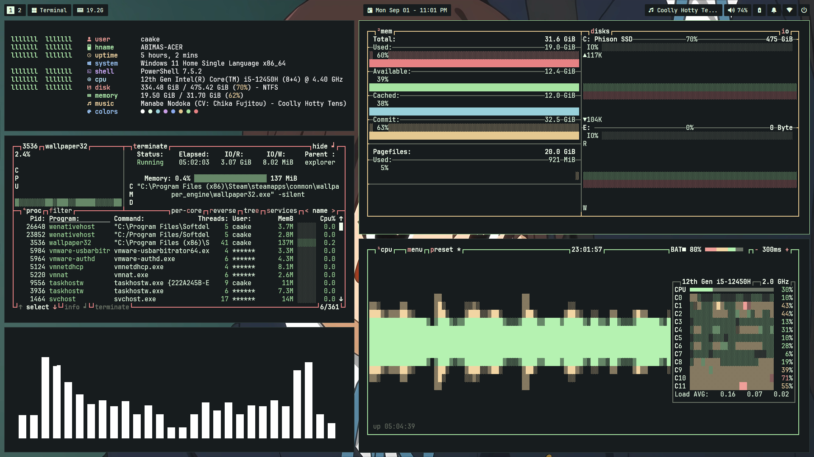
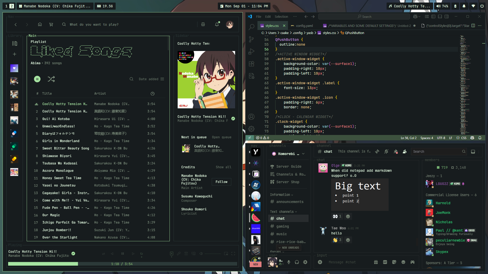
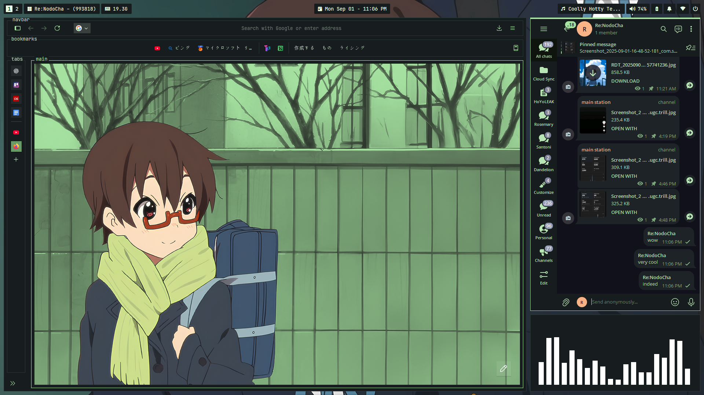

# NodoCha For Windows
A specially crafted port of the NodoCha theme, designed for use on Windows.

# What is NodoCha?
NodoCha is a Catppuccin-inspired color scheme with soft pastel and earthy matcha tones, blended with inspiration from my favorite K-ON!! character, Manabe Nodoka.

## Screenshots

## Feature List
- Matching YASB and GlazeWM Theme
- Themed Windows UI such as Notification Toast, Notification center, etc
- Animated Wallpaper and Static Wallpaper
- Themed Windows Lockscreen
- Start Menu completely disabled
- Completely hidden top Windows taskbar

## Windhawk Mods List
- Lock Screen Styler - [Config](./Mods/Lockscreen.txt) (Fork Windows 11 Start menu styler and change all the includes to LockApp.exe)
- Customize Windows Notification Placement - [Config](./Mods/Notification.txt) 
- Disable Rounded Corners in Windows 11
- No Focus Rectangle
- Taskbar Height and Icon Size
- Taskbar on Top For Windows 11
- Taskbar Tray Icons Tweak
- Windows 11 Notification Center Styler
- Windows 11 Start Menu Styler
- Windows 11 Taskbar Styler

## Feature Status
| Name                      | Status                        |
|---------------------------|-------------------------------|
| Basic Colors              |🟢 Third Party apps only       |
| Third Party Apps          |🟡 Partial                     |
| Websites (Stylus)         |🟡 Partial                     |
| Windows UI                |🟡 Partial                     |
| Custom Theme (msstyles)   |🔴 Not yet implemented         |