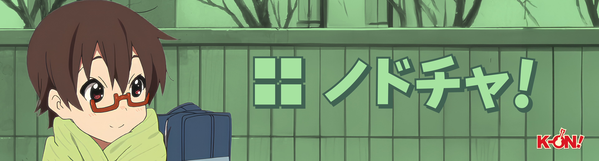

# NodoCha For Windows
A specially crafted port of the NodoCha theme, designed for use on Windows.

# What is NodoCha?
NodoCha is a Catppuccin-inspired color scheme with soft pastel and earthy matcha tones, blended with inspiration from my favorite K-ON!! character, Manabe Nodoka.

## Navigation
[🦅 Windhawk Mods](#windhawk-mods-lists-and-previews)           [🪟 Third Party App Themes](#third-party-apps-themes)           [🖌️ Stylus Config](#windhawk-mods-lists-and-previews)           [🖼️ Static Wallpapers](#windhawk-mods-lists-and-previews)           [📼 Animated Wallpapers](#windhawk-mods-lists-and-previews)           [📊 Feature Status](#windhawk-mods-lists-and-previews)

## Feature List
- Matching YASB and GlazeWM Theme
- Themed Windows UI such as Notification Toast, Notification center, etc
- Animated Wallpaper and Static Wallpaper
- Themed Windows Lockscreen
- Start Menu completely disabled
- Completely hidden top Windows taskbar
- Stylized Lockscreen

## Windhawk Mods Lists and Previews

- Lockscreen Left Aligned [⚙️ Left Aligned Config](./Mods/Lockscreen-left.txt)
- Lockscreen Right Aligned [⚙️ Right Aligned Config](./Mods/Lockscreen-right.txt)
> Fork Windows 11 Start menu styler and change all the includes to LockApp.exe

- Windows 11 Notification Styler [⚙️ Config](./Mods/notification.txt)
- Windows 11 Start Menu Styler [⚙️ Config](./Mods/start.txt) (This will disable your start menu, but not the search bar)
- Windows 11 Taskbar Styler [⚙️ Config](./Mods/taskbar.txt) (This will make your taskbar invisible)
- Notification Placement [⚙️ Config](./Mods/placement.txt)
- Taskbar Height and Icon Size [⚙️ Config](./Mods/taskbariconsize.txt) (This will make your taskbar invisible)

### Other Mods
- Disable Rounded Corners in Windows 11
- No Focus Rectangle
- Taskbar on Top For Windows 11

## Third Party Apps Themes
#### Bar

- [YASB](https://github.com/amnweb/yasb) with custom [⚙️ Config](./Third%20Party%20Apps/yasb/config.yaml) and [⚙️ Styles](./Third%20Party%20Apps/yasb/styles.css)
#### Shell

- [Nilesoft Shell](https://nilesoft.org/) with custom [⚙️ Styles](./Third%20Party%20Apps/theme.nss)
#### Discord

- Modified theme from [System24](https://github.com/refact0r/system24) with [Vencord](https://vencord.dev/) theme
#### Spotify

- [Spicetify](https://spicetify.app/) with [Text Theme](https://github.com/spicetify/spicetify-themes/tree/master/text) [⚙️ Config](./Third%20Party%20Apps/spice-main.txt) [⚙️ Custom CSS Addon](./Third%20Party%20Apps/spice-css.txt)
#### Telegram Desktop
- (Work in Progress)
#### Visual Studio Code

- [Visual Studio Code](https://code.visualstudio.com/) with custom [⚙️ Theme](./Third%20Party%20Apps/NodoCha.json)
#### Terminal

- Windows Terminal with custom color scheme [⚙️ Config](./Third%20Party%20Apps/winterm.txt)

## Feature Status
| Name                      | Status                        |
|---------------------------|-------------------------------|
| Basic Colors              |🟢 Third Party apps only       |
| Third Party Apps          |🟡 Partial                     |
| Websites (Stylus)         |🟡 Partial                     |
| Windows UI                |🟡 Partial                     |
| Custom Theme (msstyles)   |🔴 Not yet implemented         |