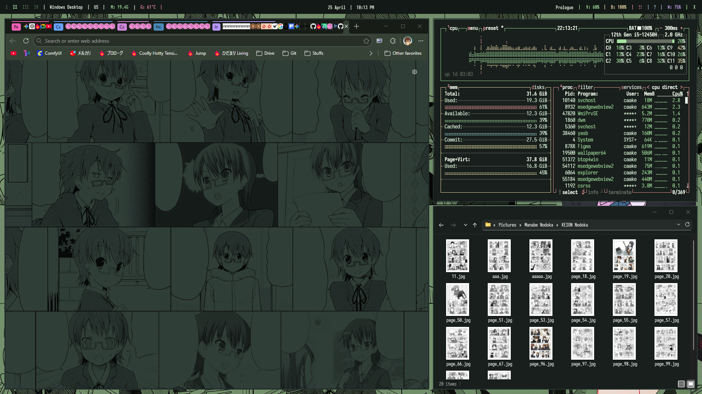
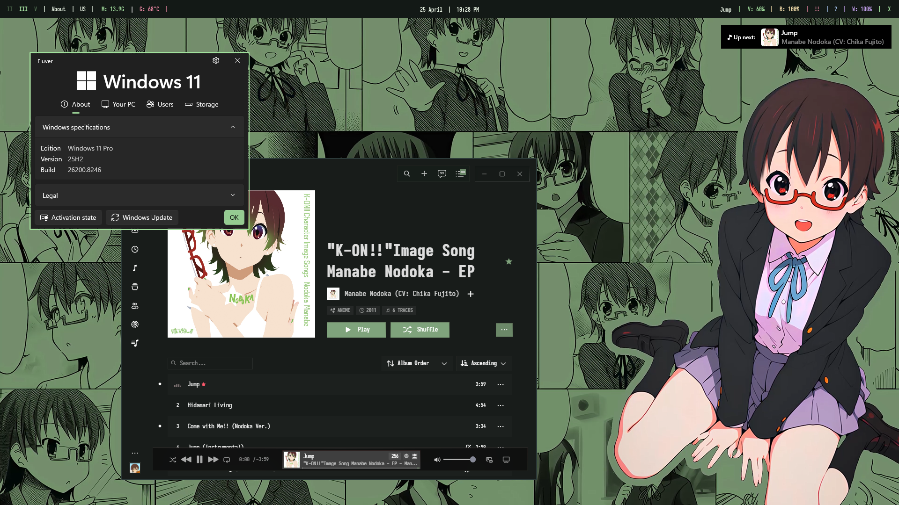
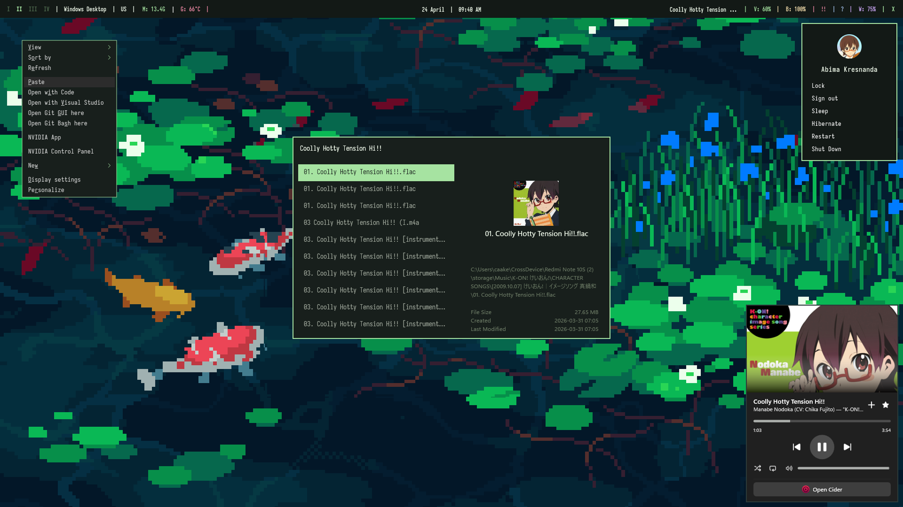
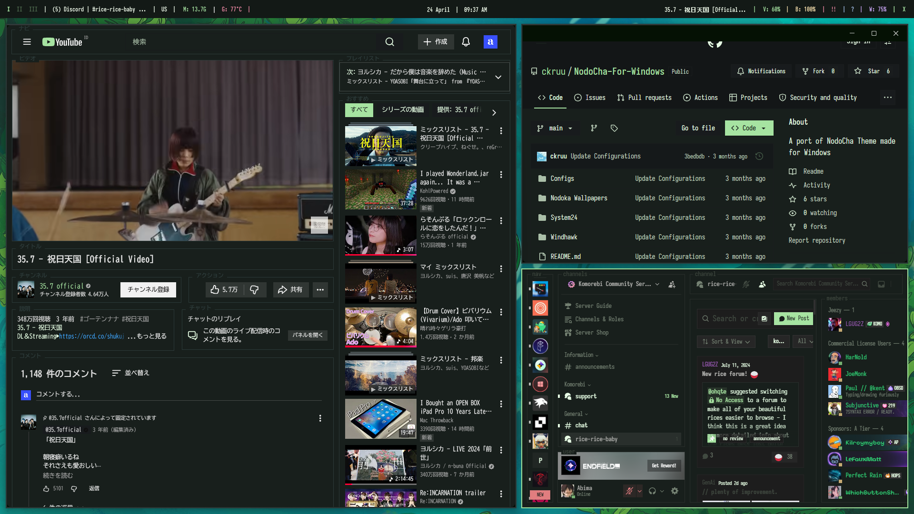

 

 

# NodoCha Windows Setup
A calm, greenish theme inspired by my favorite character, Nodoka Manabe from K-ON!, carefully crafted to match her gentle tone and personality.

[Windhawk Mods](#windhawk-mods) •
[Third-party Apps](#third-party-apps)

### Preview
<table>
  <tr>
    <td></td>
    <td></td>
  </tr>
  <tr>
    <td></td>
    <td></td>
  </tr>
</table>

#### Features
- Matching themes across apps and bars
- Themed Windows UI such as Notification Toast, Notification center, etc
- Fully Keyboard driven (No start menu and taskbar)
- Themed Windows Lockscreen

#### Windhawk Mods
#### 1. Lockscreen Styler (Start Menu Fork)
> [📜 Config](./Windhawk/Lockscreen.txt) • [🔠 Quinquefive - Clock Font](https://ggbot.itch.io/quinquefive-font) • [🔠 Pixelify Sans - Date Font](https://fonts.google.com/specimen/Pixelify+Sans) - Currently only on the left side. This font are the fonts shown in the preview, if you wish to use another font, just change it on windhawk style.

#### 2. Windows 11 Notification Center Styler
> [ℹ️ Mod Details](https://windhawk.net/mods/windows-11-notification-center-styler) • [📜 Config](./Windhawk/NCenter.txt)

#### 3. Windows Notification Placement
> [ℹ️ Mod Details](https://windhawk.net/mods/notifications-placement) • [📜 Config](./Windhawk/NPlacement.txt) - Will mess up when used in diffrent DPI and resolution.

#### 4. Windows 11 Taskbar Styler
> [ℹ️ Mod Details](https://windhawk.net/mods/windows-11-taskbar-styler) • [📜 Config](./Windhawk/Taskbar.txt) - This will make your taskbar completely invisible, also removing the start button.

#### 5. Other Mods with no or minimal configurations
- A bunch of Rectify Windhawk Mods
- SecHealth UI, refer to [this](https://github.com/AromaKitsune/Windows-XAML-Styles/blob/main/styles/WindowsSecurity.yaml)
- [Block start menu and hosts](https://windhawk.net/mods/block-windows-startmenu-and-hosts)
- [Disable rounded corners in Windows 11](https://windhawk.net/mods/disable-rounded-corners)
- [Disable taskbar thumbnails](https://windhawk.net/mods/taskbar-thumbnails)
- [Explorer font changer](https://windhawk.net/mods/explorer-font-changer)
- [Hide search bar](https://windhawk.net/mods/hide-search-bar)
- [Invisible window borders](https://windhawk.net/mods/invisible-borders)
- [No focus rectangle](https://windhawk.net/mods/no-focus-rectangle)
- [Remove command bar](https://windhawk.net/mods/remove-command-bar)
- [Taskbar height and icon size](https://windhawk.net/mods/taskbar-icon-size) - Set the value of everything to 1.
- [Taskbar on top for Windows 11](https://windhawk.net/mods/taskbar-on-top)
- [Taskbar tray system icon tweaks](https://windhawk.net/mods/taskbar-tray-system-icon-tweaks)
- [UXTheme hook](https://windhawk.net/mods/uxtheme-hook) - Optional, if you want to use custom themes.
- [Windows 11 Command bar](https://windhawk.net/mods/win7-command-bar)

## Third Party Apps
#### GlazeWM
A custom [🪟 GlazeWM](https://github.com/glzr-io/glazewm) [🎨 Config](./Third%20Party%20Apps/glazewm/config.yaml)

#### YASB
- [📊 YASB](https://github.com/amnweb/yasb) with custom [⚙️ Config](./yasb/config.yaml) and [🎨 Styles](./yasb/styles.css)

#### Tacky-borders
[📏 Tacky Borders](https://github.com/lukeyou05/tacky-borders) - A custom border for Windows 11, with a custom [🎨 Config](./Third%20Party%20Apps/tacky-borders/config.yaml)

#### Nilesoft Shell
Get [📬 Nilesoft Shell](https://nilesoft.org/) • With [🎨 Theme](./Desktop/Flow%20Launcher/theme.nss).

#### Vesktop (Discord)
A custom modification of [📬 System24](https://github.com/refact0r/system24) theme.

#### Cider
- [🍸 Cider](https://cider.sh/) with [📜 Unround Everything](./Cider/Unround_Everything.cidersnippet) • [📜 Cider v4 NodoCha](./Cider/Cider_4_NodoCha.cidersnippet) • [📜 Hide Scrollbars](./Cider/Hide_Scollbars.cidersnippet) - Set the accent color to , and the tint color to .
> This CSS was currently only tested with Cider v4 Beta, experiences may vary on other versions.

#### VS Code
[🎨 Theme](./VS%20Code/NodoCha.json) running on [VS Code](https://code.visualstudio.com/download)

#### Windows Terminal
Windows terminal with focus mode and [🎨 NodoCha](./Windhawk/WT.txt) theme.